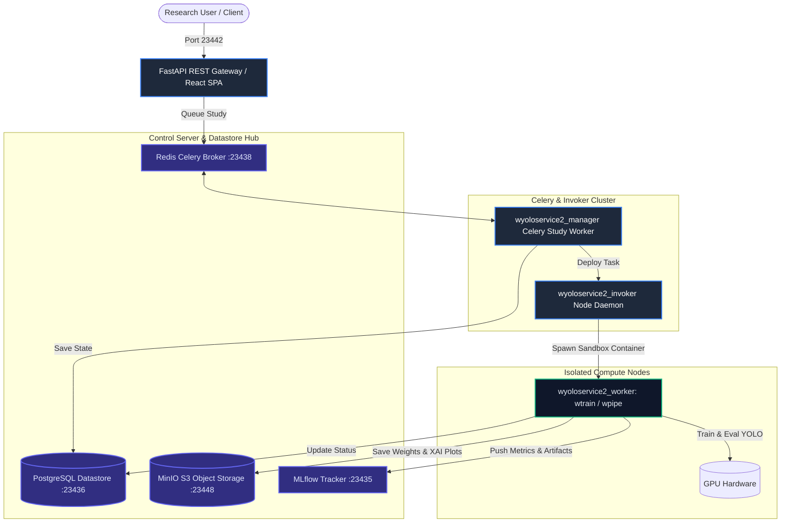

# NeuralForgeAI (train_service_2) Project Specification & Research Reference

NeuralForgeAI is an enterprise-grade, distributed MLOps platform for scalable object detection training, genetic hyperparameter evolution, and forensic Explainable AI (XAI) validation on Computer Vision models (YOLOv8, YOLOv11, YOLO26). 

---

## 🌀 Central Metaphor: The Airport Hub
*   **The Control Tower (`wyoloservice2_manager`):** Receives flight requests (training runs), schedules them, and optimizes flight routes (Optuna hyperparameter tuning).
*   **The Hangar Daemons (`wyoloservice2_invoker`):** Own the physical gates and hardware. They inspect incoming cargo, authorize access, and deploy individual container crews.
*   **The Flight Crews (`wyoloservice2_worker`):** Ephemeral Docker containers that fly the training runs to their destination. They follow a strict 22-step checklist, generate diagnostics, and self-terminate upon landing.
*   **The Flight Logs (`wyoloservice2_control_server`):** Global databases, S3 buckets, and metric dashboards that keep the logs and flight status persistent.

---

## 📐 System Architecture Diagram

---

## 🏛️ Sibling Repositories Portfolio

1.  **`NeuralForgeAI` (Frontend & Gateway):**
    *   *Role:* User Portal.
    *   *Tech:* React 19 SPA (WDarwin Ops) and FastAPI REST Gateway on Port `23442`. Handles study orchestration and cluster dashboard.
2.  **`wyoloservice2_control_server` (Master Datastore Stack):**
    *   *Role:* Data Layer.
    *   *Ports:* Redis `:23438`, PostgreSQL `:23436`, MinIO S3 `:23448`, MLflow `:23435`. Includes a fallback Gradio UI.
3.  **`wyoloservice2_manager` (Celery Optimizer):**
    *   *Role:* Study coordinator.
    *   *Tech:* Executes Optuna genetic loops (TPESampler) to evaluate hyperparameter mutations.
4.  **`wyoloservice2_invoker` (GPU Node Daemon):**
    *   *Role:* Resource Isolation.
    *   *Tech:* Python daemon managing host hardware quotas, Samba CIFS mounts, and spinning up ephemeral Docker execution engines.
5.  **`wyoloservice2_worker` (Execution Engine):**
    *   *Role:* Core Compute.
    *   *Tech:* Runs the `wtrain` / `wpipe` lifecycle scripts inside isolated Docker layers, performing the 22-step model execution, XAI rendering, and LLM-based report generation.
6.  **`wyoloservice2_mcp` (Model Context Protocol):**
    *   *Role:* Agentic integration.
    *   *Tech:* FastMCP server (`wyolo-mcp`) providing tools to LLMs (Antigravity, Cursor, Claude) to query and trigger clusters.
7.  **`wyoloservice2_production` (Deployment Hub):**
    *   *Role:* Infrastructure.
    *   *Tech:* Docker-compose files, unified Makefiles, watchdog systemd scripts, and Watchtower auto-updating configurations.
8.  **`wyoloservice2_paper` (Academic Hub):**
    *   *Role:* Publication compilation.
    *   *Tech:* Contains LaTeX sources, Spanish translations, compiled PDFs, and Python benchmark generators.

---

## 🔬 Core Scientific and Technical Vectors

### 1. Invoker-Executor Fault Isolation (Papers 1 & 2)
To resolve catastrophic cluster failures (OOM, GPU hang, memory leaks) during massive hyperparameter search loops:
*   The **Invoker** monitors system quotas (CPU, RAM, GPU VRAM) and spawns an ephemeral Docker container for each training trial.
*   The **Executor** processes only one trial and self-destructs immediately, releasing all system sockets, CUDA contexts, and page-locked host memory.

### 2. WPipe: Forensic Declarative Pipelines (Paper 8)
A SQLite-backed pipeline engine designed to ensure 100% execution traceability:
*   Pipelines are defined declaratively with strict Pydantic type validation.
*   Every intermediate execution state, input/output hash, and metric is stored in a local SQLite file.
*   In the event of a crash, the pipeline resumes exactly from the last successful checkpoint.

### 3. Quantitative Explainable AI (XAI) Fidelity (Paper 3 & R&D 9)
Moving beyond subjective heatmap visual reviews:
*   Generates GRAD-CAM, Grad-CAM++, and Eigen-CAM maps for object detection layers.
*   **Fidelity Auditing:** Evaluates maps quantitatively using **Deletion AUC** (gradually removing high-importance pixels to measure score drop) and **Insertion AUC** (introducing high-importance pixels to a blank image to measure score increase).
*   Applies **t-SNE mappings** on the final bottleneck layer to evaluate class segregation under optimization.

### 4. Robustness, Noise & Sensor Degradation (Papers 4 & 11)
Auditing model resilience prior to production deployment:
*   **Adversarial Audits:** Applies Fast Gradient Sign Method (FGSM) and PGD attacks to measure adversarial vulnerability.
*   **Noise Resiliency:** Simulates environmental degradation (Gaussian noise, motion blur, rain/fog filters) to measure degradation curves.
*   **Uncertainty Estimation:** Uses Monte Carlo Dropout (MC Dropout) to calculate epistemic and aleatoric uncertainty on bounding boxes.

### 5. FID-Based Domain Shift Prediction (Paper 5 & R&D 8)
Predicting accuracy degradation under domain shifts:
*   Calculates **Fréchet Inception Distance (FID)** between the source training dataset and the target deployment dataset.
*   Uses a calibrated regression model with **Bootstrap 95% Confidence Intervals** to predict final mAP degradation.
*   Applies a **Shift-Left Gatekeeper** to block model deployment if predicted degradation exceeds tolerance.

---

## 📋 The 22-Step Worker Pipeline Lifecycle (`wtrain` / `wpipe`)
Every training run executed by `wyoloservice2_worker` follows this sequence:

1.  **Node Provisioning:** Host Invoker allocates resources and launches the Docker container.
2.  **Container Handshake:** Worker verifies container health and DB connection.
3.  **Environment Audit:** Scans CPU cores, RAM, GPU model, CUDA version, and storage.
4.  **Study Fetching:** Pulls hyperparameters and configs from PostgreSQL.
5.  **Dataset Mount:** Connects to Samba share containing training inputs.
6.  **Dataset Sanity Check (Shift-Left):** Validates image integrity and annotations.
7.  **S3 Handshake:** Establishes connection with MinIO S3 bucket.
8.  **Local Workspace Setup:** Prepares scratch and tracking directories.
9.  **MLflow Initialization:** Registers the active run on MLflow.
10. **Pre-Training Evaluator:** Computes initial baseline metrics on the selected model weights.
11. **Training Loop Execution:** Trains YOLO (v8, v11, v26) using PyTorch.
12. **Intermediate Checkpointing:** Pushes checkpoint weights to MinIO during training.
13. **Validation Epoch:** Computes final precision, recall, mAP50, and mAP50-95.
14. **Explainable AI (XAI) Extraction:** Renders Grad-CAM heatmaps.
15. **XAI Quantitative Fidelity Check:** Runs Deletion/Insertion AUC benchmarks.
16. **Adversarial Robustness Audit:** Attacks validation set using FGSM.
17. **Sensor Degradation Simulation:** Benchmarks validation set under noise and blur.
18. **Domain Shift Estimation:** Calculates FID against target datasets.
19. **OpenCode Narrative Generation:** Local LLM writes post-training diagnostic summary.
20. **Artifact Archival:** Zips and uploads final weights, plots, and PDF reports to MinIO.
21. **Postgres Sync:** Updates PostgreSQL study database state to `SUCCESS`.
22. **Graceful Exit:** Worker terminates itself, releasing all host GPU allocations.
