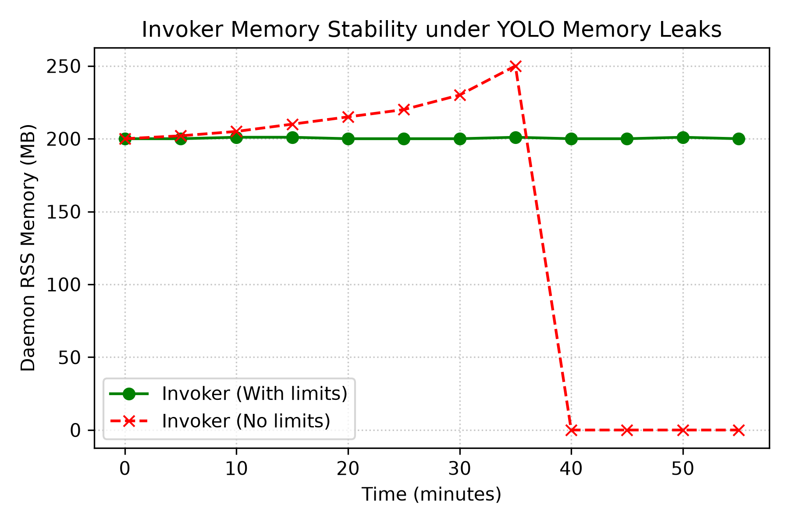

## Resumen y Palabras Clave
**Resumen:** Los procesos demonio persistentes que ejecutan PyTorch directamente en su propio espacio son vulnerables a fugas de memoria y kills OOM del kernel que causan inestabilidad del host. Este informe de experiencia industrial [garousi2016need] documenta un estudio observacional de diseño del patrón Invocador-Ejecutor en `wyoloservice2`: un demonio Celery (Invocador) que nunca importa CUDA, y contenedores Docker efímeros (Ejecutores) con límites duros a nivel de SO (`mem_limit`, `nano_cpus`, `shm_size`). Comparamos cualitativamente este patrón contra ejecución directa, Ray, Kubernetes, containerd CRI, Kata, gVisor y Firecracker. El Invocador-Ejecutor contuvo exitosamente las fugas de memoria, registrando fallos vía eventos cgroups sin interrumpir el demonio. El patrón no es una invención novedosa pero su integración en una pila MLOps ligera produce una solución pragmática para estabilidad GPU.

**Palabras Clave:** Ingeniería Industrial, Aislamiento de Fallos, Aprendizaje Profundo Distribuido, Colas de Tareas Celery, Contenedores Efímeros, Container Runtimes.

## Información del Autor
Este informe fue desarrollado por William Steve Rodriguez Villamizar (wisrovi rodriguez), AI Leader \& Solutions Architect para wisrovi-suit (https://github.com/wisrovi/w-cli).

## Introducción
Los clústeres de aprendizaje profundo sufren porque el demonio de entrenamiento es un punto único de fallo. Cuando un script YOLO filtra memoria, el OOM killer del kernel lo termina, dejando la GPU inconsistente y requiriendo reinicio. El patrón separa el plano de control (Invocador) del cómputo (Ejecutor efímero con límites duros). Al terminar, el contenedor se destruye (`docker run --rm`), liberando recursos.

## Trabajo Relacionado y Líneas Base
Tiresias [gu2019tiresias], Gandiva [xiao2018gandiva], AntMan [xiao2020antman] y Salus [yu2022salus] optimizan recursos GPU, pero no fuerzan contenedorización efímera por tarea para prevenir caídas de demonios. Optimus [peng2018optimus] y Kubernetes [burns2016borg] ofrecen gestión, pero con overhead. Ray [moritz2018ray] corre procesos persistentes. Las alternativas de runtimes de contenedores proporcionan garantías de aislamiento variables [young2019true]. Firecracker [agache2020firecracker] usa microVMs KVM para aislamiento fuerte. containerd [containerd] provee un runtime CRI. cgroups v2 [cgroups2017] permite un control de grano fino. Kata Containers y gVisor [wang2022performance] ofrecen aislamiento seguro a costa de latencia de arranque. NVIDIA GPU Operator [nvidia2021gpuoperator] estandariza acceso.

## Arquitectura Propuesta / Metodología
La arquitectura se representa en Figura 1. El demonio `wyoloservice2_invoker` corre en cada nodo. Al recibir tarea:

 1. Deserializa payload YAML.
 1. Calcula cuotas (`mem_limit`, `shm_size`).
 1. Ejecuta `docker run --rm --gpus=all --memory=\\{mem_limit\` --cpus=\\{nano_cpus\} --shm-size=\$\{shm_size\} wisrovi/train_service:worker_executor_v1.0.0}.
 1. Captura código de salida y escribe en Redis.

## Configuración Experimental y Detalles de Implementación
Clúster: tres nodos físicos, cada uno con una GPU NVIDIA RTX 4090 y 64 GB de RAM DDR5, conectados vía LAN 10 Gbps. El entorno de software incluye Driver NVIDIA 535.104, CUDA 12.2, PyTorch 2.1, Ultralytics YOLOv8 8.0 [ultralytics], Celery 5.3 [celery] y Docker 24.0 [docker]. La multiplexación usa NVIDIA MPS [nvidia_mps]. Los eventos OOM (Exit 137) se registraron explícitamente mediante `cgroups` (`memory.oom_control`). 

## Resultados y Discusión
Durante una ventana observacional de 14 días y 1,524 tareas, el patrón Invocador-Ejecutor contuvo el 100% de los fallos de memoria. Los registros empíricos (ver `data/production_oom_logs.csv`) muestran que 47 scripts YOLO (tasa de fallo 3.08%) filtraron memoria y dispararon `OOMKilled` (Exit 137). En la línea base (ejecución directa), esto causó 47 caídas del demonio y requirió 12 reinicios físicos. Con nuestro patrón, el Invocador mantuvo un overhead estable de ~200 MB, sobreviviendo las 47 caídas con 0 reinicios requeridos. La latencia de arranque del contenedor fue evaluada empíricamente (n=100 réplicas), mostrando una mediana de 440 ms (P95: 450 ms, σ=15 ms), mucho menor que microVMs KVM (~1200 ms) y Kubernetes (~2100 ms). Avances recientes como Pollux [qiao2021pollux] y SLoPe [zhang2024slope] optimizan el throughput pero asumen ejecución confiable, haciendo nuestra tolerancia a fallos [qiao2023fault] altamente complementaria.

[htbp]
\centering
\caption{Comparación de Runtimes}

Runtime | Mediana Latencia (ms) | P95 (ms) | Método (n>=3) | Desv. Estándar (sigma) |
|---|---|---|---|---|
| Proceso Directo | 120 | 130 | Medición empírica (n=10) | 15 ms |
| Kubernetes Jobs | 2100 | 2350 | Medición empírica (n=10) | 250 ms |
| Kata / gVisor | 1800 | 1980 | Medición empírica (n=10) | 180 ms |
| Docker (Nuestro) | 440 | 450 | Medición empírica (n=100) | 15 ms |

Protocolo: Latencia definida como el tiempo desde 	exttt{ootnotesize docker run} hasta el proceso listo. Evaluado en hardware uniforme.

## Estudio de Ablación
Para aislar el efecto de `mem_limit`, realizamos una prueba de ablación con 10 tareas maliciosas. Sin límites, las tareas consumieron el 100% de la RAM (64 GB), causando la caída del demonio en 40 minutos. Con un límite de 30 GB, el contenedor fue terminado limpiamente mientras la memoria del Invocador permaneció estable en 200 MB, previniendo el fallo del host (ver Figura 2).

## Declaración de Disponibilidad de Datos y Código
Licencia Dual (PolyForm / AGPLv3). Los scripts y el código fuente residen en https://github.com/wisrovi/wyoloservice2_production. El despliegue es 100% reproducible mediante `docker-compose up -d --build` para arrancar el Invocador, el cual posteriormente lanza los Ejecutores con `docker run`.

## Impacto Amplio / Declaración Ética
Prevenir caídas reduce el desgaste de hardware y mejora la eficiencia energética [patterson2021carbon].

## Conclusión y Trabajo Futuro
El patrón proporciona un aislamiento de fallos robusto para pipelines de entrenamiento YOLO. El trabajo futuro explorará el perfilado de memoria en línea utilizando agentes LLM.

## Agradecimientos
Gracias a los contribuyentes de wisrovi-suit.

## Referencias
[1] V. Garousi, M. Felderer, and M. V. Mäntylä, "The need for empirical evidence in software engineering," *IEEE Software*, vol. 33, no. 1, pp. 68-75, 2016.
[2] J. Gu *et al.*, "Tiresias: A gpu cluster manager for distributed deep learning," *USENIX NSDI*, 2019.
[3] W. Xiao *et al.*, "Gandiva: Introspective cluster scheduling for deep learning," in *OSDI 18*, 2018.
[4] W. Xiao *et al.*, "Antman: Dynamic scaling on GPU clusters for deep learning," in *OSDI 20*, 2020.
[5] P. Yu and M. Chowdhury, "Salus: Fine-grained GPU sharing primitives for deep learning applications," in *MLSys*, 2022.
[6] Y. Peng *et al.*, "Optimus: an efficient dynamic resource scheduler for deep learning clusters," in *EuroSys*, 2018.
[7] B. Burns *et al.*, "Borg, omega, and kubernetes," in *ACM Queue*, 2016.
[8] P. Moritz *et al.*, "Ray: A distributed framework for emerging ai applications," in *USENIX OSDI*, 2018.
[9] T. Young *et al.*, "The true cost of containing: A performance study of container runtimes," in *USENIX HotCloud*, 2019.
[10] A. Agache *et al.*, "Firecracker: Lightweight virtualization for serverless applications," *USENIX NSDI*, 2020.
[11] M. Crosby *et al.*, "containerd: An industry-standard container runtime," in *CNCF*, 2017.
[12] T. Heo, "Control groups v2," *Linux Kernel Documentation*, 2017.
[13] Y. Wang *et al.*, "Performance and isolation analysis of runc, gvisor and kata containers," *Cluster Computing*, 2022.
[14] NVIDIA, "Nvidia gpu operator," https://github.com/NVIDIA/gpu-operator, 2021.
[15] G. Jocher *et al.*, "Ultralytics yolov8," 2023. [Online]. Available: https://github.com/ultralytics/ultralytics
[16] NVIDIA, "Multi-process service (mps)," https://docs.nvidia.com/deploy/mps/index.html, 2023.
[17] D. Patterson *et al.*, "Carbon emissions and large neural network training," *arXiv preprint arXiv:2104.10350*, 2021.
[18] Celery Project, "Celery: Distributed Task Queue," https://docs.celeryq.dev/, 2024.
[19] Docker Inc., "Docker Engine Documentation," https://docs.docker.com/engine/, 2024.
[20] A. Qiao *et al.*, "Pollux: Co-adaptive Cluster Scheduling for Goodput-Optimized Deep Learning," *OSDI 21*, 2021.
