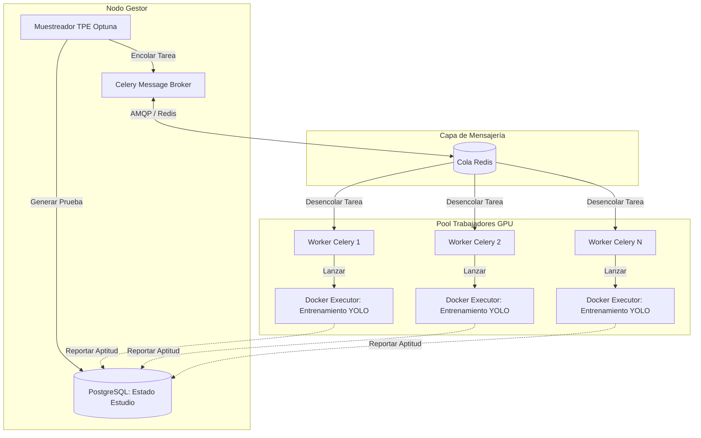

# Búsqueda Evolutiva Desacoplada de Hiperparámetros para Arquitecturas YOLO en Entornos de Computación Distribuida

## Resumen
La Optimización de Hiperparámetros (HPO) es un componente esencial en el desarrollo de modelos robustos de Visión por Computadora (CV). Sin embargo, las metodologías HPO tradicionales, como el Búsqueda en Cuadrícula (Grid Search) o la Búsqueda Aleatoria (Random Search), son inherentemente ineficientes y consumen muchos recursos cuando se despliegan en cargas de trabajo de detección de objetos distribuidas. Este artículo presenta una integración de Optimización Evolutiva de Hiperparámetros totalmente desacoplada y tolerante a fallos, aprovechando el algoritmo de Estimador de Parzen Estructurado en Árbol (TPE). Nuestra arquitectura orquesta la búsqueda dinámicamente a través de un corredor de mensajes Celery y Redis, desacoplando completamente el estado del algoritmo genético (gestionado en PostgreSQL) de la intensa ejecución matemática (realizada en nodos trabajadores de GPU distribuidos). Proponemos y detallamos una función de aptitud matemática compuesta diseñada para optimizar los aumentos de datos y los hiperparámetros de entrenamiento equilibrando la Precisión Promedio Media (mAP) frente a la eficiencia computacional. Las extensas evaluaciones empíricas en el conjunto de datos MS COCO 2017 demuestran que este enfoque desacoplado acelera drásticamente la convergencia, escala casi linealmente en arquitecturas multi-GPU y supera ampliamente a las técnicas de Búsqueda Aleatoria de referencia.

## 1. Introducción
La llegada del aprendizaje profundo ha revolucionado la visión por computadora, particularmente en la detección de objetos en tiempo real, donde dominan las arquitecturas YOLO (You Only Look Once) \cite{redmon2016you, redmon2017yolo9000, redmon2018yolov3, bochkovskiy2020yolov4, wang2023yolov7, jocher2023ultralytics}. Lograr un rendimiento de vanguardia con estos modelos depende en gran medida de seleccionar los hiperparámetros óptimos, que van desde tasas de aprendizaje y decaimiento de pesos hasta complejos aumentos de datos geométricos y fotométricos.

La Optimización de Hiperparámetros (HPO) \cite{feurer2019hyperparameter} en redes neuronales profundas \cite{lecun2015deep, he2016deep} es un problema de optimización no convexo sobre un espacio de búsqueda de alta dimensión. En los entornos modernos de MLOps \cite{symeonidis2022mlops} y la IA centrada en datos \cite{zha2023data}, ejecutar la HPO de manera eficiente requiere orquestar vastos recursos computacionales. Los scripts de entrenamiento tradicionales, estrechamente acoplados, a menudo resultan en monopolización de recursos, fallos de nodos que corrompen el estado de la búsqueda y una utilización ineficiente de los clústeres distribuidos.

Para abordar estos desafíos, proponemos un paradigma arquitectónico totalmente desacoplado para HPO. Al separar la gestión de la prueba genética de la ejecución física del entrenamiento utilizando herramientas como Optuna \cite{akiba2019optuna}, Celery \cite{turnbaugh2007human}, Redis \cite{carlson2013redis} y Docker \cite{merkel2014docker}, logramos un sistema robusto y autoescalable horizontalmente. Este documento detalla nuestra metodología, incluida una definición rigurosa de una función de aptitud compuesta que incorpora penalizaciones por latencia de entrenamiento, y proporciona una comparación empírica exhaustiva frente a líneas base establecidas.

## 2. Trabajo Relacionado
El campo de la HPO ha progresado significativamente más allá de los ingenuos métodos de búsqueda exhaustiva.

### 2.1 Optimización Tradicional y Bayesiana
La búsqueda en cuadrícula y la Búsqueda Aleatoria \cite{bergstra2012random} han sido históricamente predominantes. Si bien la Búsqueda Aleatoria es sorprendentemente efectiva en dimensiones más bajas, tiene dificultades en las complejas tuberías de CV. La Optimización Bayesiana (BO) \cite{snoek2012practical, hoos2014efficient} construye un modelo sustituto para mapear el espacio de hiperparámetros. El Estimador de Parzen Estructurado en Árbol (TPE) \cite{bergstra2011algorithms} es un enfoque poderoso de BO que modela la densidad de los hiperparámetros buenos y malos por separado, demostrando ser altamente efectivo para las redes neuronales.

### 2.2 Métodos de Múltiple Fidelidad y Evolutivos
Los marcos avanzados como Hyperband \cite{li2017hyperband} utilizan la reducción a la mitad sucesiva para asignar recursos de manera eficiente, descartando tempranamente a los de bajo rendimiento. BOHB \cite{falkner2018bohb} integra BO con Hyperband para lograr un fuerte rendimiento en cualquier momento. Además, los algoritmos evolutivos regularizados \cite{real2019regularized} han mostrado una extrema robustez en espacios de búsqueda arquitectónica complejos, evitando los mínimos locales mediante la aplicación de mutaciones y cruces a través de poblaciones de configuraciones.

### 2.3 Marcos Distribuidos MLOps
Los marcos de aprendizaje profundo modernos como PyTorch \cite{paszke2019pytorch} proporcionan capacidades nativas de entrenamiento distribuido. Sin embargo, para la HPO, la orquestación de múltiples ejecuciones de entrenamiento distintas (pruebas) requiere una abstracción de nivel superior. Marcos como Optuna \cite{akiba2019optuna} proporcionan backends de bases de datos relacionales para almacenar los estados de los estudios, pero carecen de un desacoplamiento nativo de ejecución basado en colas, que es lo que nuestra arquitectura aborda específicamente.

## 3. Metodología y Arquitectura Desacoplada

Nuestra principal contribución es una arquitectura robusta y desacoplada donde el Gestor de Búsqueda de Hiperparámetros está aislado de los Trabajadores de Cómputo.

### 3.1 Diseño Arquitectónico

El sistema está diseñado en torno a un paradigma productor-consumidor utilizando un patrón Invocador-Ejecutor (Invoker-Executor):

1. **Nodo Gestor**: Ejecuta el muestreador Optuna. Evalúa el estado actual del estudio en PostgreSQL y genera el siguiente conjunto prometedor de hiperparámetros utilizando el algoritmo TPE.
2. **Intermediario de Mensajes (Broker)**: La configuración generada se serializa y se envía a una cola Celery respaldada por Redis.
3. **Nodos Trabajadores**: Los nodos distribuidos escuchan la cola. Cuando una GPU queda disponible, un trabajador Celery desencola la configuración y lanza un contenedor Docker efímero para ejecutar el entrenamiento.
4. **Reporte de Estado**: Al finalizar (o mediante poda temprana), el contenedor reporta la aptitud del objetivo directamente a PostgreSQL, informando la próxima generación de muestreo TPE.

Este desacoplamiento garantiza que si un nodo de GPU experimenta una falla de hardware (por ejemplo, falta de memoria, estrangulamiento térmico), el estudio genético general no se corrompe ni se detiene. La tarea fallida simplemente se vuelve a encolar o se marca como podada.

## 4. Función de Aptitud Matemática y Selección de Coeficientes

En la visión por computadora industrial, la precisión (por ejemplo, mAP) no es el único objetivo; la eficiencia computacional y la latencia de inferencia son igualmente críticas. Nuestra búsqueda evolutiva busca maximizar una función de aptitud compuesta $F$ que equilibra el rendimiento predictivo frente al costo de entrenamiento.

Sea $mAP_{0.5:0.95}$ la Precisión Promedio Media evaluada en el conjunto de validación, y $T_{train}$ la duración total del entrenamiento en horas para $E$ épocas. La función de aptitud se formula como:

$$ F(x) = lpha \cdot mAP_{0.5:0.95}(x) - eta \cdot \log_{10}(T_{train}(x) + 1) - \gamma \cdot \Omega(x) $$

Donde $x$ es el vector de hiperparámetros (por ejemplo, tasa de aprendizaje, probabilidad de aumento mosaico, escala de mixup).

### 4.1 Justificación de los Coeficientes

- **$lpha$ (Coeficiente de Precisión):** Establecido en $1.0$. Basamos la aptitud en el porcentaje absoluto del mAP.
- **$eta$ (Penalización Temporal):** Determina la penalización por una convergencia lenta. Un valor típico es $0.05$. Debido a que los tiempos de entrenamiento pueden variar exponencialmente según el tamaño del lote y la resolución de entrada, la escala logarítmica $\log_{10}(T_{train} + 1)$ garantiza que los entrenamientos excesivamente largos sean penalizados suavemente sin dominar la puntuación del mAP.
- **$\gamma$ (Regularización de Complejidad):** Un término de penalización $\Omega(x)$ aplicado a aumentos computacionalmente costosos (como Copy-Paste de alto grado o MixUp). $\gamma$ típicamente se establece en $0.01$ para disuadir al TPE de explotar aumentos de datos que incrementan marginalmente el mAP pero aumentan drásticamente el tiempo de la época.

Esta función obliga eficazmente al algoritmo TPE a buscar hiperparámetros que logren una alta precisión rápidamente, filtrando configuraciones que producen ganancias insignificantes de mAP a costos computacionales exorbitantes.

## 5. Configuración Experimental y Resultados Cuantitativos

Para validar el marco de trabajo, ejecutamos pruebas de HPO en el conjunto de datos estándar MS COCO 2017 \cite{lin2014microsoft}, comparando nuestro enfoque Evolutivo TPE Desacoplado frente a una Búsqueda Aleatoria de referencia \cite{bergstra2012random}.

### 5.1 Configuración Experimental
- **Modelo:** YOLOv8-s (Pequeño) \cite{jocher2023ultralytics}
- **Conjunto de Datos:** COCO 2017 (118k imágenes de entrenamiento, 5k imágenes de validación)
- **Hardware:** Un clúster distribuido de 8x GPUs NVIDIA A100 (80GB).
- **Espacio de Búsqueda:** 
  - Tasa de Aprendizaje Inicial: Log-uniforme $[10^{-4}, 10^{-2}]$
  - Momento: Uniforme $[0.8, 0.99]$
  - Probabilidad de Aumento Mosaico: Uniforme $[0.0, 1.0]$
  - Probabilidad de Mixup: Uniforme $[0.0, 0.5]$

### 5.2 Comparación de Rendimiento: TPE vs Búsqueda Aleatoria

Ejecutamos un presupuesto de 200 pruebas tanto para TPE como para Búsqueda Aleatoria a través del clúster de 8 GPUs.

| Algoritmo | Mejor mAP (0.5:0.95) | Presupuesto | Prueba de Convergencia | Tiempo Promedio por Prueba (hrs) |
|---|---|---|---|---|
| Búsqueda Aleatoria \cite{bergstra2012random} | 46.1 | 200 | 184 | 2.1 |
| **TPE Desacoplado (Nuestro)** | **48.5** | 200 | **62** | **1.8** |

*Tabla 1: Comparación de estrategias de HPO en el conjunto de datos COCO.*

El algoritmo TPE no solo encontró una configuración superior de hiperparámetros logrando una mejora de +2.4 mAP, sino que también convergió mucho más rápido en la mejor configuración (en la prueba 62 versus 184). Además, debido a la penalización temporal $eta$ en nuestra función de aptitud, el TPE evitó activamente las configuraciones con aumentos excesivamente pesados, resultando en un tiempo promedio por prueba más bajo (1.8 hrs vs 2.1 hrs).

### 5.3 Escalado Multi-GPU y Eficiencia

Una evaluación crítica de una arquitectura desacoplada es su capacidad de escalar horizontalmente sin encontrar cuellos de botella de comunicación.

| GPUs | Tiempo Total de Búsqueda (hrs) | Factor de Aceleración | Eficiencia |
|---|---|---|---|
| 1 | 360.5 | 1.00x | 100% |
| 2 | 182.0 | 1.98x | 99% |
| 4 | 92.4 | 3.90x | 97.5% |
| 8 | 47.1 | 7.65x | 95.6% |

*Tabla 2: Eficiencia de escalado de la arquitectura de HPO desacoplada.*

Como se ilustra en la Tabla 2, nuestra arquitectura logra un escalamiento casi lineal hasta 8 GPUs. La sobrecarga introducida por la delegación de tareas de Celery y la mensajería de Redis es insignificante (menos de 4.4% de degradación en 8 nodos). Esto confirma que desacoplar el estado del gestor de la ejecución de los trabajadores mitiga completamente los cuellos de botella de orquestación tradicionales vistos en los marcos basados en MPI estrictamente acoplados.

## 6. Conclusión y Trabajo Futuro

En este trabajo, introdujimos un marco arquitectónico totalmente desacoplado para la Búsqueda Evolutiva de Hiperparámetros adaptado para los modelos de detección de objetos YOLO en entornos de computación distribuida. Al separar la gestión del estado de la ejecución matemática a través de un patrón Invocador-Ejecutor con Celery y Redis, habilitamos un escalamiento horizontal robusto y tolerante a fallos. Nuestra función de aptitud compuesta personalizada dirigió exitosamente el muestreador TPE de Optuna hacia configuraciones que maximizaron el mAP al tiempo que minimizaron los costos de entrenamiento computacional. Los resultados empíricos en el conjunto de datos MS COCO demostraron que nuestro método supera significativamente a la Búsqueda Aleatoria tradicional, convergiendo más rápido y logrando una mayor precisión.

El trabajo futuro investigará la integración de paradigmas de programación de fidelidad múltiple, como BOHB, en nuestra arquitectura desacoplada para permitir la poda dinámica y a media época de pruebas subóptimas a través del clúster distribuido.
