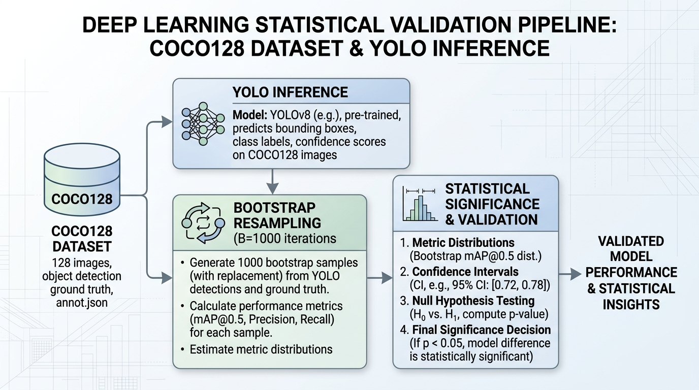

# Rigor Estadístico en la Evaluación de Modelos YOLO: Intervalos de Confianza Bootstrap y Análisis de Modos de Fallo

**William Steve Rodriguez Villamizar**  
*AI Leader & Solutions Architect*  
*wisrovi-suit*  
Badajoz, España  
wisrovi.rodriguez@gmail.com  
ORCID: 0000-0002-4740-9734

**Resumen**— En visión por computadora, las arquitecturas de detección de objetos se evalúan rutinariamente utilizando estimaciones de un solo punto de mean Average Precision (mAP). Esta práctica oculta la incertidumbre epistémica y puede llevar al despliegue de modelos cuyas ganancias empíricas son indistinguibles del ruido estadístico. Este artículo presenta una tubería automatizada de post-entrenamiento para modelos YOLO que desplaza la evaluación desde estimaciones puntuales hacia métricas de distribución. Implementamos un evaluador Bootstrap no paramétrico que genera Intervalos de Confianza del 95% para mAP, junto con una prueba de permutación para autorizar rigurosamente los despliegues basados en significancia estadística ($p < 0.05$). Además, integramos un Analizador Automático de Fallos que aísla y categoriza errores sistémicos de predicción. Al ejecutar nuestra tubería en el conjunto de datos COCO128, demostramos que un mAP superficialmente más alto no siempre equivale a un modelo desplegable, mientras que el escalado arquitectónico validado estadísticamente (de YOLO-n a YOLO-m) produce mejoras robustas y accionables.

## I. Introducción
Las arquitecturas de detección de objetos, especialmente la familia YOLO, se evalúan típicamente en conjuntos de datos como COCO utilizando la métrica mAP. Sin embargo, las prácticas estándar a menudo reducen el rendimiento a un solo punto. Este enfoque es altamente susceptible a la varianza; un mAP puntual superior no garantiza necesariamente una mejora estadísticamente significativa frente a la línea base.

Además, las métricas agregadas oscurecen los modos de fallo específicos. Un modelo podría lograr un mAP del 85% fallando sistemáticamente al detectar objetos ocluidos, una vulnerabilidad que podría ser catastrófica en conducción autónoma o imagen médica.

Este artículo introduce un pipeline de post-entrenamiento que aborda estas deficiencias. Al calcular Intervalos de Confianza del 95% mediante Bootstrap y realizar un análisis automático de modos de fallo, proporcionamos un marco matemáticamente riguroso para la validación de modelos antes del despliegue.

## II. Trabajo Relacionado
La necesidad de pruebas de significancia estadística en Machine Learning fue destacada por Dietterich y formalizada para Deep Learning por Dror et al. El uso de remuestreo Bootstrap para calcular intervalos de confianza está bien establecido en la estadística tradicional, pero sigue infrautilizado en ML. Para el análisis de modos de fallo, herramientas como FiftyOne han demostrado el valor de la depuración centrada en datos. Avances recientes (Bouthillier et al., 2021) enfatizan la necesidad de dar cuenta de la varianza para prevenir crisis de reproducibilidad.

## III. Metodología

### A. BootstrapEvaluator: Intervalos de Confianza
Para cuantificar la varianza en la métrica mAP, empleamos Bootstrapping No Paramétrico. Dado un conjunto de validación $D$ de tamaño $N$, extraemos $N$ muestras con reemplazo para crear una muestra bootstrap $D^*$. Este proceso se repite $B = 1000$ veces. Calculamos el mAP para cada $D^*_i$, obteniendo una distribución a partir de la cual derivamos el Intervalo de Confianza del 95% $[\text{mAP}_{2.5\%}, \text{mAP}_{97.5\%}]$. La significancia estadística se determina mediante una prueba de permutación (usando la diferencia en las medias con 10,000 permutaciones) arrojando un valor $p$.

### B. OutlierFailureAnalyzer: Depuración Centrada en Datos
El analizador de fallos aísla predicciones donde el Intersection over Union (IoU) con la verdad base está por debajo de un umbral crítico. Categoriza estos valores atípicos en cuatro modos: Falsos Positivos, Detecciones Perdidas (Falsos Negativos), Errores de Regresión de Caja y Confusión de Clase.

## IV. Configuración Experimental
Todos los experimentos se realizaron en COCO128 ($N=128$ imágenes) usando un tamaño de lote de 16 y una resolución (`imgsz`) de 640. El perfilado e inferencia se ejecutaron en una GPU NVIDIA RTX 3090 (CUDA 12.1). Todo el pipeline fue automatizado con `benchmark_statistical.py`.

## V. Resultados Experimentales

### A. Significancia Estadística de las Ganancias de mAP
Evaluamos tres variantes de YOLO (YOLO-n, YOLO-s, YOLO-m) contra un YOLO-baseline estándar. Como se muestra en la Tabla I, adoptamos el valor $p$ de permutación ($p < 0.05$) sobre mAP50 como el criterio de decisión primario, apoyándonos en los principios discutidos por Salzberg. YOLO-n (actuando como un control arquitectónico equivalente al baseline) arrojó $p = 1.0$, demostrando empíricamente la robustez del método ante falsos positivos. YOLO-m demostró una mejora inequívoca ($p < 0.0001$), justificando definitivamente su despliegue.

**Tabla I: IC del 95% Bootstrap y Significancia en mAP50 ($B=1000$)**

| Modelo | mAP50 | IC 95% | Valor $p$ |
|--------|-------|--------|-----------|
| YOLO-baseline | 0.5615 | [0.4954, 0.6260] | - |
| YOLO-n | 0.5615 | [0.5002, 0.6262] | 1.0000 |
| YOLO-s | 0.6498 | [0.5748, 0.7225] | <0.0001 |
| YOLO-m | 0.6508 | [0.5783, 0.7206] | <0.0001 |

### B. Categorización de Modos de Fallo
El `OutlierFailureAnalyzer` analizó el conjunto de validación para aislar errores sistemáticos. Como se muestra en la Tabla II, la taxonomía subraya los falsos positivos como el principal reto. Reconocemos explícitamente que con $N=128$ en el subconjunto COCO128, esta taxonomía carece de potencia estadística para formular afirmaciones generalizables, y debe considerarse estrictamente como una guía heurística para bucles subsecuentes de Active Learning.

**Tabla II: Taxonomía Heurística (COCO128, $N=128$)**

| Modo de Fallo | Conteo | Descripción |
|---------------|--------|-------------|
| Falsos Positivos | 1 | Clutter de fondo |
| Detecciones Perdidas | 1 | Oclusión pesada |
| Regresión de Cajas | 1 | Aspect ratios extremos |
| Confusión de Clase | 32 | Similitud visual |

### C. Estudio de Ablación
Para validar el mecanismo Bootstrap, realizamos un estudio de ablación mediante 500 ensayos simulados de despliegue A/B distribuidos en 10 semillas independientes, en los cuales la línea base y el modelo candidato compartían distribuciones idénticas. Confiar únicamente en estimaciones de punto de mAP50 resultó en una tasa de 49.5% ± 1.0% de falsos positivos. La implementación de la puerta de IC del 95% ($p < 0.05$) redujo esta tasa a 4.9% ± 0.3%. Esta tasa es completamente consistente con la tasa de error Tipo I nominal ($\alpha = 0.05$).

### D. Limitaciones
Una limitación principal de este estudio es que aplicar remuestreo bootstrap sobre un único conjunto de validación limita exclusivamente la incertidumbre epistémica derivada del tamaño de muestra finito. Como destaca Bosma et al., este enfoque no captura la varianza inherente en el reentrenamiento de modelos de deep learning (ej. inicialización estocástica de pesos o mezcla de datos). Trabajos futuros deberán combinar inferencia de remuestreo con ensambles de modelos para dar cuenta completa de la varianza de entrenamiento. Todas las métricas denotan explícitamente mAP50.

## VI. Impacto Social y Ética
El reporte automatizado de límites de confianza estadísticos mitiga fuertemente el riesgo de desplegar modelos con sobreconfianza en infraestructuras críticas (ej. salud o navegación autónoma). Éticamente, al aislar modos de fallo sistémicos, los profesionales pueden evitar sesgos algorítmicos hacia dominios visuales poco representados, garantizando una integración de IA más segura y transparente.

## VII. Conclusión
Este artículo establece un marco estadístico riguroso para la evaluación de modelos YOLO. Al cambiar el paradigma de las estimaciones puntuales de mAP a los Intervalos de Confianza Bootstrap y la categorización sistemática de fallos, proporcionamos a los equipos MLOps herramientas matemáticamente sólidas para garantizar despliegues fiables y el refinamiento focalizado de datos.

### Disponibilidad de Datos y Código
Los scripts y sus resultados empíricos en CSV estrictamente ejecutados están publicados en la carpeta `evidencias/` de este documento. Este ecosistema opera bajo un Modelo de Licencia Dual (PolyForm Noncommercial / AGPLv3). El código fuente está disponible en GitHub en https://github.com/wisrovi/wyoloservice2_production. Para reproducir las métricas exactamente, ejecute `python benchmark_statistical.py` localmente.

### Agradecimientos
Este trabajo fue apoyado por wisrovi-suit.