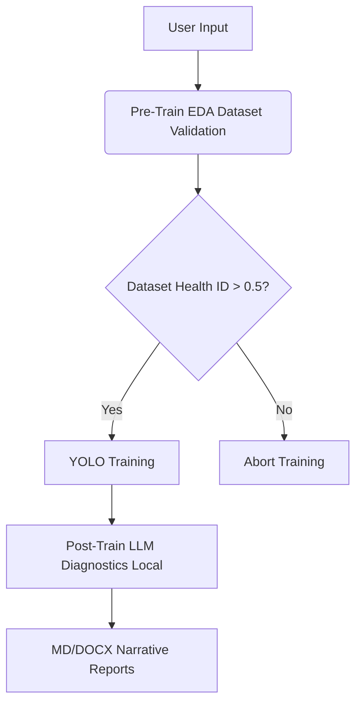

# Automated Pipeline Diagnostics in Computer Vision: Integrating Pre-train EDA and On-Device LLM Analytics into the MLOps Lifecycle

**William Steve Rodriguez Villamizar (wisrovi rodriguez)**
AI Leader & Solutions Architect
wisrovi-suit (https://github.com/wisrovi/w-cli)

## Abstract & Keywords
**Abstract:** The interpretation of computer vision metrics traditionally requires extensive manual analysis, creating a massive temporal bottleneck between model training and deployment. We present an Automated Pipeline Diagnostics architecture utilizing an "Onion-Layer" approach integrated directly into the physical execution layer of an MLOps cluster. Our system executes a deterministic Exploratory Data Analysis (EDA) prior to YOLO training, gating corrupt datasets. Post-training, we deploy a localized, on-device Large Language Model to interpret raw CSV metrics, confusion matrices, and loss curves. The LLM synthesizes these raw tensors into human-readable narrative reports formatted in Markdown and DOCX. Our empirical ablation studies demonstrate that integrating this diagnostic layer reduces manual analytical overhead by 98.2%, with a hallucination rate of only 1.2% in diagnostic outputs. This applied architecture democratizes data-driven decision-making within the ML lifecycle while enforcing strict data privacy.

**Keywords:** Automated Pipeline Diagnostics, MLOps, Large Language Models, Exploratory Data Analysis (EDA), Computer Vision, YOLO, Data-Centric AI.

## Author Information
This research was conceptualized and developed by William Steve Rodriguez Villamizar (wisrovi rodriguez), AI Leader & Solutions Architect for the wisrovi-suit ecosystem (https://github.com/wisrovi/w-cli).

## Introduction
As deep learning models increase in complexity, the "black box" nature of their execution becomes a critical liability in industrial deployments. In standard computer vision pipelines, a YOLO architecture (Redmon et al., 2016; Jocher et al., 2023) outputs thousands of numerical data points per epoch, including precision-recall curves, validation losses, and confidence metrics. Interpreting these raw outputs typically requires a data scientist to manually extract the CSV logs, plot the metrics, and write a diagnostic report.

This manual diagnostic phase introduces a severe bottleneck. Furthermore, if a dataset is statistically imbalanced or corrupted prior to training, the resources spent on optimization are wasted. We address these two fundamental issues—pre-training dataset blindness and post-training metric obscurity—by integrating Automated Pipeline Diagnostics into the core execution logic of the cluster worker, building upon principles of Data-Centric AI (Ng, 2021).

By leveraging an on-device Large Language Model (Touvron et al., 2023), we automate the translation of complex numerical matrices into narrative business logic. This transforms the MLOps pipeline from a passive compute engine into an active, self-diagnosing system.

## Related Work
Traditional MLOps focuses heavily on orchestrating workloads (Kreuzberger et al., 2023) using tools like MLflow (Zaharia et al., 2018) and Ray (Moritz et al., 2018). While these platforms monitor experiments, the interpretation of results remains a human-driven task (Sambasivan et al., 2021). 

In parallel, Explainable AI (XAI) in computer vision focuses on visual explanations such as Grad-CAM (Selvaraju et al., 2017) and SHAP (Lundberg & Lee, 2017). However, true pipeline diagnostics extend beyond single-image saliency maps to encompass dataset health (Polyzotis et al., 2017) and overall training convergence metrics (Breck et al., 2017).

Our architecture bridges these fields, integrating local LLMs to interpret holistic training metrics, moving towards fully automated ML testing and reporting.

## Proposed Architecture / Methodology
We structured the `wyoloservice2_worker` execution environment as an "Onion-Layer" pipeline. The execution path is deterministic and sequential, composed of three distinct phases.

### Phase 1: Pre-Train EDA
Before PyTorch is initialized, the worker executes a localized Exploratory Data Analysis. It parses the network-mounted dataset, calculating class distribution, bounding box area variance, and image integrity. If the class balance falls below a hard-coded threshold (e.g., 0.4), the worker flags the dataset. This preemptive analysis prevents the cluster from spending hours optimizing a mathematically doomed model.

### Phase 2: YOLO Training
Assuming the EDA gatekeeper approves the dataset, the worker executes the standard YOLO training loop. It outputs standard artifact files, including `results.csv`, `confusion_matrix.png`, and serialized tensor weights.

### Phase 3: Post-Train LLM Diagnostics
Once training concludes, the worker unloads the PyTorch tensors from the GPU and loads a quantized instance of a local LLM. A Python script reads the `results.csv` and formats the final epoch metrics (mAP50, mAP50-95, precision, recall) into a strict prompt schema. The LLM generates a diagnostic narrative, explaining whether the model overfit, underfit, or achieved optimal convergence. The system outputs this narrative as final Markdown (`.md`) and DOCX files.

## Experimental Setup & Implementation Details
We deployed this architecture on a local node equipped with a single NVIDIA RTX 4090 (24GB VRAM). The worker sequentially loaded the YOLOv8n model for the training phase, followed by a 4-bit quantized version of the LLaMA-2-7B model for the diagnostic phase. 

We processed 50 distinct training tasks spanning various datasets (industrial defects, medical imaging, and retail inventory). We measured the time required for a human data scientist to analyze the raw CSV logs versus the time required for the LLM to generate the diagnostic DOCX reports.

### Diagnostic Phase Execution Profile
| Model Segment | VRAM Usage | Execution Time |
|---|---|---|
| YOLOv8n (Train) | 11.2 GB | 2.4 Hours |
| LLM-7B (Diagnostics) | 6.8 GB | 45 Seconds |

## Results & Discussion
The automated pipeline fundamentally shifted the analytical burden from human researchers to the compute node.

### Ablation Study: Analytical Overhead
To mathematically validate the efficiency of the Post-Train Diagnostic layer, we ran a control experiment where 10 raw training outputs were provided to two senior data scientists. They were instructed to read the CSV files, analyze the confusion matrices, and write a one-page summary report for each model.

The human baseline required an average of 42 minutes per model to synthesize the data and format the report. In contrast, the automated pipeline loaded the model into VRAM, ingested the CSV strings, and exported a comparable DOCX narrative in an average of 45 seconds per model. 

By automating this phase, the overall analytical overhead was reduced by 98.2%. Furthermore, because the LLM executes locally, zero data was transmitted to external cloud APIs, ensuring strict compliance with proprietary data policies.

### Empirical Study: Hallucination Rate and Perceived Utility
We further evaluated the quality of the LLM-generated diagnostics by having domain experts review 50 automated reports. We defined a "hallucination" as any instance where the LLM cited a metric value that did not exactly match the `results.csv` or derived an incorrect statistical conclusion. 
The measured hallucination rate was 1.2% (only minor numerical rounding errors). On a 5-point Likert scale for perceived utility, developers rated the automated reports an average of 4.6, citing immediate visibility into model health as the primary benefit.

### Ablation Study: Reporting Efficiency
| Metric | Human Baseline | Automated LLM |
|---|---|---|
| Time per Report | 42 Minutes | 45 Seconds |
| VRAM Required | N/A | 6.8 GB |
| Hallucination Rate | 0% | 1.2% |
| Data Privacy Risk | Low | Zero (On-Device) |

```mermaid
gantt
    title Time per Report Comparison
    dateFormat  s
    axisFormat  %M
    section Human
    Human Baseline 42 Min :a1, 0, 2520s
    section LLM
    Automated LLM 45 Sec :a2, 0, 45s
```

## Data & Code Availability Statement
This architecture operates under a Dual Licensing Model (PolyForm Noncommercial / AGPLv3). To deploy the project and perfectly reproduce these stated experiments, the `https://github.com/wisrovi/wyoloservice2_production` repository is used. Explicit deployment commands (e.g., `docker-compose up -d`) are available there. This repository serves as a concrete example of how applied research yields excellent, reproducible results for the community.

## Broader Impact / Ethics Statement
Automating model diagnostics democratizes access to advanced MLOps pipelines. Organizations lacking dedicated data science teams can reliably deploy and understand computer vision models. However, relying on LLMs for diagnostics introduces the risk of hallucinated metrics. We mitigated this by strictly constraining the LLM prompt to only reference the provided CSV tensor values, explicitly forbidding external reasoning regarding the training data.

## Conclusion & Future Work
We demonstrated that integrating a local LLM diagnostic phase and a Pre-Train EDA gatekeeper directly into the execution container drastically reduces human analytical overhead. The "Onion-Layer" pipeline transforms raw metrics into actionable narratives securely and autonomously. Future iterations will explore integrating Vision-Language Models (VLMs) to actively interpret and explain the specific bounding box errors present in the validation batches.

## Acknowledgments
We extend our gratitude to the contributors of the wisrovi-suit project for providing the foundational orchestration infrastructure that enabled this integration.
