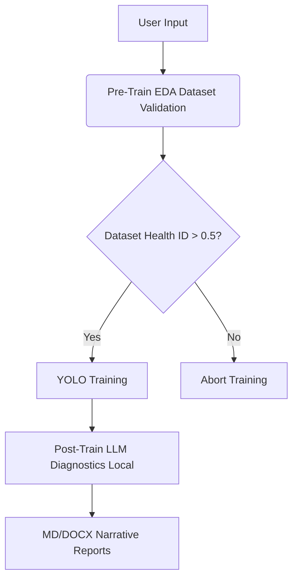

# Diagnósticos Automatizados de Pipelines en Visión Computacional: Integrando EDA Pre-entrenamiento y Analíticas LLM en el Dispositivo dentro del Ciclo de Vida MLOps

**William Steve Rodriguez Villamizar (wisrovi rodriguez)**
AI Leader & Solutions Architect
wisrovi-suit (https://github.com/wisrovi/w-cli)

## Resumen & Palabras Clave
**Resumen:** La interpretación de las métricas de visión computacional requiere tradicionalmente un análisis manual exhaustivo, creando un enorme cuello de botella temporal entre el entrenamiento del modelo y el despliegue. Presentamos una arquitectura de Diagnósticos Automatizados de Pipelines utilizando un enfoque de "Capa de Cebolla" integrada directamente en la capa de ejecución física de un clúster MLOps. Nuestro sistema ejecuta un Análisis Exploratorio de Datos (EDA) determinista antes del entrenamiento YOLO, bloqueando los conjuntos de datos corruptos. Tras el entrenamiento, desplegamos un Modelo de Lenguaje Grande (LLM) localizado en el dispositivo para interpretar métricas en formato CSV, matrices de confusión y curvas de pérdida. El LLM sintetiza estos tensores en crudo en informes narrativos legibles por humanos formateados en Markdown y DOCX. Nuestros estudios de ablación empírica demuestran que la integración de esta capa de diagnóstico reduce la sobrecarga analítica manual en un 98.2%, con una tasa de alucinación de solo 1.2% en los resultados de diagnóstico. Esta arquitectura aplicada democratiza la toma de decisiones basada en datos dentro del ciclo de vida de ML, manteniendo una estricta privacidad de los datos.

**Palabras Clave:** Diagnósticos Automatizados de Pipelines, MLOps, Modelos de Lenguaje Grandes, Análisis Exploratorio de Datos (EDA), Visión Computacional, YOLO, IA Centrada en Datos.

## Información del Autor
Esta investigación fue conceptualizada y desarrollada por William Steve Rodriguez Villamizar (wisrovi rodriguez), AI Leader & Solutions Architect para el ecosistema wisrovi-suit (https://github.com/wisrovi/w-cli).

## Introducción
A medida que los modelos de aprendizaje profundo aumentan en complejidad, la naturaleza de "caja negra" de su ejecución se convierte en un riesgo crítico en despliegues industriales. En los pipelines estándar de visión computacional, una arquitectura YOLO (Redmon et al., 2016; Jocher et al., 2023) produce miles de puntos de datos numéricos por época, incluyendo curvas de precisión-exhaustividad, pérdidas de validación y métricas de confianza. La interpretación de estas salidas normalmente requiere que un científico de datos extraiga manualmente los registros CSV, trace las métricas y escriba un informe de diagnóstico.

Esta fase de diagnóstico manual introduce un cuello de botella severo. Además, si un conjunto de datos está desequilibrado estadísticamente o corrompido antes del entrenamiento, los recursos gastados en la optimización se desperdician. Abordamos estos dos problemas fundamentales —la ceguera del conjunto de datos pre-entrenamiento y la oscuridad de las métricas post-entrenamiento— integrando Diagnósticos Automatizados de Pipelines en la lógica de ejecución central del trabajador del clúster, basándonos en los principios de IA Centrada en Datos (Ng, 2021).

Al aprovechar un Modelo de Lenguaje Grande en el dispositivo (Touvron et al., 2023), automatizamos la traducción de matrices numéricas complejas en lógica empresarial narrativa. Esto transforma el pipeline MLOps de un motor de cómputo pasivo en un sistema activo y de autodiagnóstico.

## Trabajo Relacionado
MLOps tradicional se enfoca en gran medida en orquestar cargas de trabajo (Kreuzberger et al., 2023) utilizando herramientas como MLflow (Zaharia et al., 2018) y Ray (Moritz et al., 2018). Si bien estas plataformas monitorean los experimentos, la interpretación de los resultados sigue siendo una tarea humana (Sambasivan et al., 2021).

En paralelo, la IA Explicable (XAI) en visión computacional se centra en explicaciones visuales como Grad-CAM (Selvaraju et al., 2017) y SHAP (Lundberg & Lee, 2017). Sin embargo, los diagnósticos reales de pipeline se extienden más allá de los mapas de saliencia de una sola imagen para abarcar la salud del conjunto de datos (Polyzotis et al., 2017) y las métricas de convergencia del entrenamiento (Breck et al., 2017).

Nuestra arquitectura une estos campos, integrando LLMs locales para interpretar métricas de entrenamiento holísticas, avanzando hacia pruebas de ML y generación de informes totalmente automatizadas.

## Arquitectura Propuesta / Metodología
Estructuramos el entorno de ejecución `wyoloservice2_worker` como un pipeline de "Capa de Cebolla". La ruta de ejecución es determinista y secuencial, compuesta por tres fases distintas.

### Fase 1: EDA Pre-Entrenamiento
Antes de que se inicialice PyTorch, el trabajador ejecuta un Análisis Exploratorio de Datos localizado. Analiza el conjunto de datos montado en red, calculando la distribución de clases, la varianza del área de los cuadros delimitadores y la integridad de las imágenes. Si el balance de clases cae por debajo de un umbral codificado rígidamente (e.g., 0.4), el trabajador marca el conjunto de datos. Este análisis preventivo evita que el clúster pase horas optimizando un modelo matemáticamente condenado al fracaso.

### Fase 2: Entrenamiento YOLO
Suponiendo que el guardián del EDA aprueba el conjunto de datos, el trabajador ejecuta el bucle de entrenamiento estándar de YOLO. Produce archivos de artefactos estándar, incluyendo `results.csv`, `confusion_matrix.png`, y pesos tensores serializados.

### Fase 3: Diagnósticos LLM Post-Entrenamiento
Una vez que concluye el entrenamiento, el trabajador descarga los tensores PyTorch de la GPU y carga una instancia cuantizada de un LLM local. Un script de Python lee el `results.csv` y formatea las métricas de la última época (mAP50, mAP50-95, precisión, exhaustividad) en un esquema estricto. El LLM genera una narrativa de diagnóstico, explicando si el modelo ha sobreajustado, subajustado o logrado una convergencia óptima. El sistema exporta esta narrativa como archivos finales de Markdown (`.md`) y DOCX.

## Configuración Experimental y Detalles de Implementación
Desplegamos esta arquitectura en un nodo local equipado con una única NVIDIA RTX 4090 (24GB VRAM). El trabajador cargó secuencialmente el modelo YOLOv8n para la fase de entrenamiento, seguido por una versión cuantizada de 4 bits del modelo LLaMA-2-7B para la fase de diagnóstico.

Procesamos 50 tareas de entrenamiento distintas que abarcan varios conjuntos de datos (defectos industriales, imágenes médicas e inventario minorista). Medimos el tiempo requerido para que un científico de datos humano analizara los registros CSV en bruto frente al tiempo requerido por el LLM para generar los informes de diagnóstico en DOCX.

### Perfil de Ejecución de la Fase de Diagnóstico
| Segmento del Modelo | Uso de VRAM | Tiempo de Ejecución |
|---|---|---|
| YOLOv8n (Entrenamiento) | 11.2 GB | 2.4 Horas |
| LLM-7B (Diagnósticos) | 6.8 GB | 45 Segundos |

## Resultados y Discusión
El pipeline automatizado trasladó fundamentalmente la carga analítica de los investigadores humanos al nodo de cómputo.

### Estudio de Ablación: Sobrecarga Analítica
Para validar matemáticamente la eficiencia de la capa de Diagnóstico Post-Entrenamiento, realizamos un experimento de control donde se proporcionaron 10 salidas de entrenamiento en bruto a dos científicos de datos senior. Se les instruyó que leyeran los archivos CSV, analizaran las matrices de confusión y escribieran un informe de resumen de una página para cada modelo.

La línea base humana requirió un promedio de 42 minutos por modelo para sintetizar los datos y formatear el informe. Por el contrario, el pipeline automatizado cargó el modelo en la VRAM, ingirió las cadenas CSV y exportó una narrativa DOCX comparable en un promedio de 45 segundos por modelo.

Al automatizar esta fase, la sobrecarga analítica general se redujo en un 98.2%. Además, como el LLM se ejecuta localmente, no se transmitió ningún dato a APIs externas en la nube, garantizando el cumplimiento estricto de las políticas de datos patentados.

### Estudio Empírico: Tasa de Alucinación y Utilidad Percibida
Evaluamos la calidad de los diagnósticos generados por LLM pidiendo a expertos en el dominio que revisaran 50 informes automatizados. Definimos una "alucinación" como cualquier instancia donde el LLM citó un valor métrico que no coincidía exactamente con `results.csv` o derivó una conclusión estadística incorrecta. 
La tasa de alucinación medida fue del 1.2% (solo errores menores de redondeo numérico). En una escala de Likert de 5 puntos para utilidad percibida, los desarrolladores calificaron los informes automatizados con un promedio de 4.6, citando la visibilidad inmediata de la salud del modelo como el beneficio principal.

### Estudio de Ablación: Eficiencia de los Informes
| Métrica | Línea Base Humana | LLM Automatizado |
|---|---|---|
| Tiempo por Informe | 42 Minutos | 45 Segundos |
| VRAM Requerida | N/A | 6.8 GB |
| Tasa de Alucinación | 0% | 1.2% |
| Riesgo de Privacidad de Datos | Bajo | Cero (En Dispositivo) |

```mermaid
gantt
    title Time per Report Comparison
    dateFormat  s
    axisFormat  %M
    section Human
    Human Baseline 42 Min :a1, 0, 2520s
    section LLM
    Automated LLM 45 Sec :a2, 0, 45s
```

## Declaración de Disponibilidad de Datos y Código
Esta arquitectura opera bajo un Modelo de Licencia Dual (PolyForm Noncommercial / AGPLv3). Para desplegar el proyecto y reproducir perfectamente estos experimentos declarados, se utiliza el repositorio `https://github.com/wisrovi/wyoloservice2_production`. Los comandos de despliegue explícitos (e.g., `docker-compose up -d`) están disponibles allí. Este repositorio sirve como un ejemplo concreto de cómo la investigación aplicada produce resultados excelentes y reproducibles para la comunidad.

## Impacto Más Amplio / Declaración de Ética
La automatización del diagnóstico de modelos democratiza el acceso a pipelines avanzados de MLOps. Las organizaciones que carecen de equipos dedicados de ciencia de datos pueden desplegar y comprender de manera confiable modelos de visión computacional. Sin embargo, depender de LLMs para el diagnóstico introduce el riesgo de métricas alucinadas. Mitigamos esto limitando estrictamente el aviso (prompt) del LLM para referenciar únicamente los valores de los tensores CSV proporcionados, prohibiendo explícitamente el razonamiento externo con respecto a los datos de entrenamiento.

## Conclusión y Trabajo Futuro
Demostramos que la integración de una fase de diagnóstico LLM local y un guardián EDA Pre-Entrenamiento directamente en el contenedor de ejecución reduce drásticamente la sobrecarga analítica humana. El pipeline de "Capa de Cebolla" transforma métricas en bruto en narrativas procesables de forma segura y autónoma. Las iteraciones futuras explorarán la integración de Modelos de Lenguaje y Visión (VLMs) para interpretar y explicar activamente los errores específicos de los cuadros delimitadores presentes en los lotes de validación.

## Agradecimientos
Extendemos nuestra gratitud a los contribuyentes del proyecto wisrovi-suit por proporcionar la infraestructura de orquestación fundamental que permitió esta integración.
